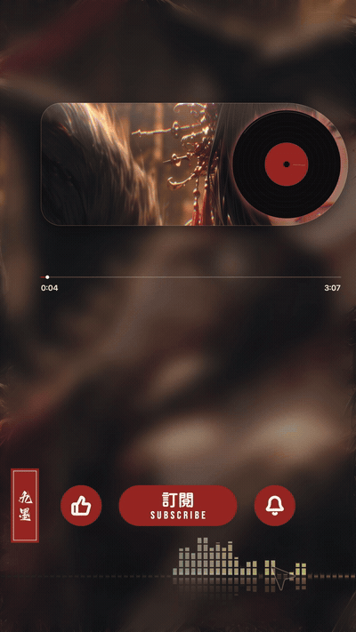

# 九墨 Jiumo · Ink Music Visualizer Studio

[English](./README.md) · [**繁體中文**](./README.zh-TW.md)


Turn your music into **living ink**. Jiumo (九墨) is a browser-based, fully client-side music visualizer studio inspired by Chinese ink-wash painting — drop in an audio file, shape the ink, add lyrics and effects, preview in real time, and export straight to video. **No install, no account, nothing leaves your browser** (your audio is decoded and rendered entirely on-device).

<p align="center">
  
  <br/><br/>
  
</p>

---

## ✨ Features

- **Ink fluid engine** — a hand-written WebGL2 Navier-Stokes fluid simulation; ink really bleeds, swirls and diffuses. Multiple ink effects: flow, drip, bloom, stir, surge, taiji, splash-burst.
- **GPU spectrum** — fragment-shader spectrum analyzer: bars / curve / level meter / radial / water-reflection / falling peak caps, with log / linear / Bark / Mel frequency scales and A/B/C weighting.
- **Ink creatures** — a procedural, skeleton-physics ink koi that swims through the fluid trailing ink. Solid color options: ink / white / gold / silver.
- **Layer system** — background image (with filters), spectrum, scrolling vertical lyrics (LRC/SRT), text, seal stamp, logo, a liquid-glass player card, and opacity layers — all keyframeable and audio-bindable.
- **Cover designer** — upload a base image, add text (stroke/shadow), overlay images (with keying/blend modes), beautify filters, and export lossless PNG up to 4K (8K on desktop).
- **Video export** — frame-accurate offline rendering via WebCodecs (faster than real time), auto-picking H.264/MP4 or VP9/WebM; trim a range on the scrubber to export just a section.

## 🛠 How it's built

Pure front-end **Next.js (App Router) + React + TypeScript + Tailwind**. The interesting parts are all hand-rolled, with zero heavyweight dependencies:

| File | What it does |
|---|---|
| `app/engine/fluid-core.ts` | WebGL2 fluid simulation |
| `app/engine/gpu-visuals.ts` | GPU spectrum / light-effect shaders |
| `app/engine/effects.ts` | Ink fluid effect recipes |
| `app/inklab/ink-creature.ts` | Ink creature skeletal physics + ink rendering |
| `app/engine/offline.ts` | Frame-by-frame WebCodecs video export |
| `app/studio/studio-client.tsx` | The studio UI |

At runtime it only pulls in `lucide-react` (icons) and `mp4-muxer` / `webm-muxer` (container muxing). Everything else — the fluid sim, the shaders, the creature physics, the export pipeline — is in this repo.

> Heads up: the studio UI is currently in Traditional Chinese. It's a single-purpose creative tool, so most of it is visual/drag-based — but PRs adding i18n are very welcome.

## 🚀 Quick start

```bash
git clone https://github.com/techtrekleo/jiumo.git
cd jiumo
npm install
npm run dev
# open http://localhost:3000
```

Needs a browser with **WebGL2** and **WebCodecs** (Chrome / Edge / recent Safari). Video export relies on WebCodecs, which is most complete on Chromium-based browsers.

### Deploy

[](https://vercel.com/new/clone?repository-url=https%3A%2F%2Fgithub.com%2Ftechtrekleo%2Fjiumo)

…or any host that runs Next.js (Netlify / Cloudflare Pages / self-host). It's pure front-end — no environment variables, no backend.

## 🔤 Fonts

The fonts bundled in `public/fonts/` are all under the **SIL Open Font License** (free for commercial use and embedding): Bakudai, JasonHW (游清松手寫), GenSen Rounded, Noto Serif TC, LXGW WenKai TC, plus Anton / Archivo Black / Bebas Neue.

## 🐟 Help wanted: more ink creatures

Honestly? This is the part I most want help with.

Right now there's a single ink koi swimming through the fluid. But I dream of a whole bestiary — a flock of ink sparrows, ink butterflies drifting, an ink snake, an ink dragon, an ink jellyfish… anything that can live and move inside the ink.

The catch: **my art skills are, frankly, garbage.** Drawing a decent silhouette is genuine torture for me. So if you can draw — or just write a bit of Canvas 2D — please come make some creatures. It's easy:

- **Easiest path** — add an entry to `BODY_PRESETS` in `app/engine/bodies.ts` with a `draw(ctx, S)` that paints a **black silhouette** of your creature. That's it. The studio stamps it into the ink field and the fluid drags its edges into wispy ink trails automatically. (Copy `drawKoi` / `drawJellyfish` in the same file as a starting point.)
- **Advanced** — want it to undulate and swim with spine physics, like the koi? See `Marrow` (skeleton) + `InkRenderer` (ink rendering) in `app/inklab/ink-creature.ts`.

You handle the *shape*; the ink engine handles the bleeding, drifting and dissolving. Open a PR with a new creature and you will genuinely make my day 🖤

## 📄 License

[MIT](./LICENSE) © techtrekleo (九黎月 Jiuliyue)

Fork it, remix it, build your own visualizer with it. If you make something cool, I'd love to see it 🖤
